<div align="center">

# 📚 ECIEXPRESS — Microservicio de Promociones

### *"Sin filas, sin estrés, ECIEXPRESS"*

---

### 🛠️ Stack Tecnológico


### ☁️ Infraestructura & Calidad


### 🏗️ Arquitectura


</div>

---

## 📑 Tabla de Contenidos

1. [👤 Integrantes](#1--integrantes)
2. [🎯 Objetivo del Microservicio](#2--objetivo-del-microservicio)
3. [⚡ Funcionalidades Principales](#3--funcionalidades-principales)
4. [📋 Estrategia de Versionamiento y Branches](#4--manejo-de-estrategia-de-versionamiento-y-branches)
   - [4.1 Convenciones para crear ramas](#41-convenciones-para-crear-ramas)
   - [4.2 Convenciones para crear commits](#42-convenciones-para-crear-commits)
5. [⚙️ Tecnologías Utilizadas](#5--tecnologias-utilizadas)
6. [🧩 Funcionalidad](#6--funcionalidad)
7. [📊 Diagramas](#7--diagramas)
8. [⚠️ Manejo de Errores](#8--manejo-de-errores)
9. [🧪 Evidencia de Pruebas y Ejecución](#9--evidencia-de-las-pruebas-y-como-ejecutarlas)
10. [🗂️ Organización del Código](#10--codigo-de-la-implementacion-organizado-en-las-respectivas-carpetas)
11. [🚀 Ejecución del Proyecto](#11--ejecucion-del-proyecto)
12. [☁️ CI/CD y Despliegue en Azure](#12--evidencia-de-cicd-y-despliegue-en-azure)
13. [🤝 Contribuciones](#13--contribuciones)

---

## 1. 👤 Integrantes:

- Elizabeth Correa
- Daniel Palacios
- David Salamanca
- Tomas Ramirez
- Carolina Cepeda

## 2. 🎯 Objetivo del microservicio

El microservicio de Promociones tiene como objetivo gestionar y aplicar de forma automática las promociones y descuentos asociados a los pedidos dentro de la plataforma ECIExpress, garantizando que los beneficios definidos por la institución o los puntos de venta se calculen correctamente antes de realizar el pago. Este servicio centraliza la lógica de descuentos, valida la vigencia y condiciones de cada promoción, y retorna el monto final ajustado, integrándose con los microservicios de Pagos, Billetera y Pedidos para asegurar consistencia, trazabilidad y una experiencia de compra transparente para los usuarios.

---

## 3. ⚡ Funcionalidades principales

<div align="center">

<table>
  <thead>
    <tr>
      <th>💡 Funcionalidad</th>
      <th>Descripción</th>
    </tr>
  </thead>
  <tbody>
    <tr>
      <td><strong>Creación de Promociones</strong></td>
      <td>Permite definir y registrar promociones con reglas de descuento, vigencia y condiciones de aplicación.</td>
    </tr>
    <tr>
      <td><strong>Validación de Vigencia</strong></td>
      <td>Verifica que la promoción se encuentre activa y dentro del rango de fechas establecido.</td>
    </tr>
    <tr>
      <td><strong>Aplicación de Descuentos</strong></td>
      <td>Calcula automáticamente el descuento aplicable a un pedido antes del proceso de pago.</td>
    </tr>
    <tr>
      <td><strong>Cálculo de Monto Final</strong></td>
      <td>Retorna el valor final del pedido después de aplicar las promociones correspondientes.</td>
    </tr>
    <tr>
      <td><strong>Gestión de Reglas de Promoción</strong></td>
      <td>Administra condiciones como tipo de cliente, monto mínimo o tipo de producto.</td>
    </tr>
    <tr>
      <td><strong>Integración con Pagos</strong></td>
      <td>Se comunica con el microservicio de Pagos para enviar el monto final ajustado por promociones.</td>
    </tr>
    <tr>
      <td><strong>Integración con Billetera</strong></td>
      <td>Coordina la aplicación de descuentos antes de realizar débitos de saldo en la billetera.</td>
    </tr>
    <tr>
      <td><strong>Trazabilidad de Promociones</strong></td>
      <td>Registra qué promociones fueron aplicadas a cada pedido para auditoría y reportes.</td>
    </tr>
    <tr>
      <td><strong>Manejo de Errores</strong></td>
      <td>Retorna respuestas claras ante promociones inexistentes, vencidas o inválidas.</td>
    </tr>
  </tbody>
</table>

</div>

## 4. 📋 Manejo de Estrategia de versionamiento y branches

### Estrategia de Ramas (Git Flow)

### Ramas y propósito
- Manejaremos GitFlow, el modelo de ramificación para el control de versiones de Git

#### `main`
- **Propósito:** rama **estable** con la versión final (lista para demo/producción).
- **Reglas:**
    - Solo recibe merges desde `release/*` y `hotfix/*`.
    - Cada merge a `main` debe crear un **tag** SemVer (`vX.Y.Z`).
    - Rama **protegida**: PR obligatorio, 1–2 aprobaciones, checks de CI en verde.

#### `develop`
- **Propósito:** integración continua de trabajo; base de nuevas funcionalidades.
- **Reglas:**
    - Recibe merges desde `feature/*` y también desde `release/*` al finalizar un release.
    - Rama **protegida** similar a `main`.

#### `feature/*`
- **Propósito:** desarrollo de una funcionalidad, refactor o spike.
- **Base:** `develop`.
- **Cierre:** se fusiona a `develop` mediante **PR**


#### `release/*`
- **Propósito:** congelar cambios para estabilizar pruebas, textos y versiones previas al deploy.
- **Base:** `develop`.
- **Cierre:** merge a `main` (crear **tag** `vX.Y.Z`) **y** merge de vuelta a `develop`.
- **Ejemplo de nombre:**  
  `release/1.3.0`

#### `hotfix/*`
- **Propósito:** corregir un bug **crítico** detectado en `main`.
- **Base:** `main`.
- **Cierre:** merge a `main` (crear **tag** de **PATCH**) **y** merge a `develop` para mantener paridad.
- **Ejemplos de nombre:**  
  `hotfix/fix-blank-screen`, `hotfix/css-broken-header`


---

### 4.1 Convenciones para **crear ramas**

#### `feature/*`
**Formato:**
```
feature/[nombre-funcionalidad]-ECIExpress_[codigo-jira]
```

**Ejemplos:**
- `feature/readme_ECIExpress-34`

**Reglas de nomenclatura:**
- Usar **kebab-case** (palabras separadas por guiones)
- Máximo 50 caracteres en total
- Descripción clara y específica de la funcionalidad
- Código de Jira obligatorio para trazabilidad

#### `release/*`
**Formato:**
```
release/[version]
```
**Ejemplo:** `release/1.3.0`

#### `hotfix/*`
**Formato:**
```
hotfix/[descripcion-breve-del-fix]
```
**Ejemplos:**
- `hotfix/corregir-pantalla-blanca`
- `hotfix/arreglar-header-responsive`

---

### 4.2 Convenciones para **crear commits**

#### **Formato:**
```
[codigo-jira] [tipo]: [descripción específica de la acción]
```

#### **Tipos de commit:**
- `feat`: Nueva funcionalidad
- `fix`: Corrección de errores
- `docs`: Cambios en documentación

## 5. ⚙️ Tecnologías Utilizadas


| **Tecnología / Herramienta** | **Uso principal en el proyecto** |
|------------------------------|----------------------------------|
| **Java OpenJDK** | Lenguaje de programación base de los microservicios backend, orientado a objetos y multiplataforma. |
| **Spring Boot** | Framework principal para construir microservicios independientes, exponiendo APIs REST y gestionando configuración e inyección de dependencias. |
| **Spring Web** | Exposición de endpoints REST en cada microservicio (controladores HTTP) dentro de la arquitectura hexagonal. |
| **Spring Security** | Configuración de autenticación y autorización mediante roles, asegurando el acceso a los endpoints de los microservicios. |
| **Spring Data MongoDB** | Integración de cada microservicio con su base de datos NoSQL en MongoDB usando el patrón Repository y puertos/adaptadores. |
| **MongoDB Atlas** | Base de datos NoSQL en la nube, con colecciones independientes por dominio (pagos, billetera, recibos, promociones, usuarios, etc.). |
| **Apache Maven** | Gestión de dependencias, empaquetado de cada microservicio y automatización de builds en los pipelines CI/CD. |
| **Lombok** | Reducción de código repetitivo en los microservicios con anotaciones como `@Getter`, `@Setter`, `@Builder` y `@AllArgsConstructor`. |
| **JUnit 5** | Framework de pruebas unitarias para validar la lógica de dominio y casos de uso en cada microservicio. |
| **Mockito** | Simulación de dependencias (puertos, repositorios, clientes externos) en pruebas unitarias sin acceder a infraestructura real. |
| **JaCoCo** | Generación de reportes de cobertura de código de los microservicios para evaluar la efectividad de las pruebas. |
| **SonarQube** | Análisis estático del código y control de calidad, identificando vulnerabilidades, code smells y problemas de mantenibilidad. |
| **Swagger (OpenAPI 3)** | Generación automática de documentación y prueba interactiva de los endpoints REST de cada microservicio. |
| **Postman** | Entorno de pruebas de la API para validar manualmente las peticiones y respuestas JSON de los distintos microservicios (`POST`, `GET`, `PATCH`, `DELETE`). |
| **Docker** | Contenerización de cada microservicio para garantizar despliegues aislados y consistentes entre entornos. |
| **Azure App Service** | Entorno de ejecución en la nube donde se despliegan los contenedores Docker de los microservicios. |
| **Azure Container Registry (ACR)** | Almacenamiento y versionado de las imágenes Docker generadas en los pipelines de CI/CD. |
| **GitHub Actions** | Pipelines de integración y despliegue continuo (CI/CD) para compilar, probar, analizar y desplegar cada microservicio. |
| **AWS API Gateway** | Punto de entrada único al backend que enruta las solicitudes del cliente al microservicio correspondiente (Pagos, Wallet, Recibos, QR, etc.). |
| **AWS Lambda (Node.js)** | Funciones ligeras que actúan como lógica intermedia cuando se requiere preprocesar o adaptar solicitudes antes de enviarlas a los microservicios. |
| **SSL / HTTPS** | Cifrado de la comunicación entre cliente, API Gateway y microservicios para garantizar la seguridad de la información. |


> 🧠 **Stack tecnológico seleccionado** para asegurar **escalabilidad**, **modularidad**, **seguridad**, **trazabilidad** y **mantenibilidad**, aplicando buenas prácticas de ingeniería de software.

## 6. 🧩 Funcionalidades

---

### 🔑 Funcionalidades principales

### 1️⃣ Crear Promoción

Permite crear una nueva promoción asociada a un producto, definiendo su vigencia y porcentaje de descuento.

**Endpoint principal:**  
`POST /api/v1/promotions`

---

### 📦 Estructura de la Solicitud (Request)

<div align="center">

| 🏷️ Campo | 🗃️ Tipo | ⚠️ Restricciones | 📝 Descripción |
|---|---|:---:|---|
| productId | String | Obligatorio, No vacío | Identificador del producto al que aplica el descuento. |
| isActive | Boolean | Obligatorio | Indica si la promoción debe activarse inmediatamente. |
| startDate | Date | Obligatorio | Fecha de inicio de la vigencia. |
| endDate | Date | Obligatorio, Posterior a startDate | Fecha de finalización de la vigencia. |
| promotionMultiplier | Double | Obligatorio, > 0 | Valor decimal del descuento (ej. 0.15 para 15%). |

</div>

---

### 📦 Estructura de la Respuesta (Response)

<div align="center">

| 🔢 Código HTTP | 📝 Descripción |
|:---:|---|
|  | **Recurso creado exitosamente.** No retorna cuerpo de respuesta. |

</div>

---

### ✅ Happy Path (Ejemplo de Uso Exitoso)

1. El cliente envía una solicitud POST con los detalles de la nueva promoción (producto, fechas, porcentaje).
2. El sistema valida que la fecha de inicio sea anterior a la de fin y que el multiplicador sea positivo.
3. Se verifica que no exista ya una promoción activa para ese producto.
4. Se crea la promoción y se persiste en la base de datos.
5. Se retorna `201 CREATED` confirmando la operación.


**Request (Solicitud):**
```json
POST /api/v1/promotions
{
  "productId": "PROD-001",
  "isActive": true,
  "startDate": "2023-11-01T00:00:00Z",
  "endDate": "2023-11-30T23:59:59Z",
  "promotionMultiplier": 0.15
}
```

**Response (Respuesta):**
```json
201 CREATED
```


---

### 🖼️ Diagrama de Secuencia

  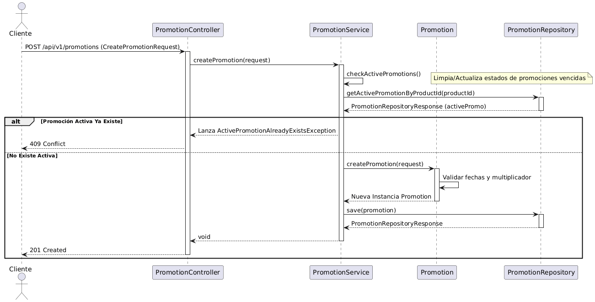


<details>
<summary><strong>🟢 Explicación del Flujo</strong></summary>

El cliente inicia el proceso enviando una solicitud POST con los detalles de la nueva promoción (producto, fechas, porcentaje). El `PromotionController` recibe la petición y la transfiere al `PromotionService`. Antes de crear nada, el servicio ejecuta una rutina de mantenimiento (`checkActivePromotions`) para actualizar el estado de promociones vencidas. Luego, verifica en el repositorio si ya existe una promoción activa para ese `productId`; si existe, detiene el proceso para evitar conflictos. Si no, invoca a la entidad de dominio `Promotion`, la cual ejecuta su lógica de fábrica validando que la fecha de inicio sea anterior a la de fin, que el multiplicador sea positivo y que, si se marca como activa, la fecha actual esté dentro del rango. Finalmente, el objeto validado se persiste a través del `PromotionRepositoryAdapter` en MongoDB y se retorna un estado 201 al cliente.

</details>

---

### 📊 Tipos de errores manejados

<div align="center">

| 🔢 **Código HTTP** | ⚠️ **Escenario** | 💬 **Mensaje de Error** |
|:------------------:|:----------------|:------------------------|
|  | Fechas inválidas | `"Promotion start date must be before end date"` |
|  | Multiplicador inválido | `"Promotion multiplier must be greater than 0"` |
|  | Inconsistencia de estado | `"Promotion must be active when now is between startDate and endDate"` |
|  | Ya existe promoción activa | `"Active promotion already exists for product: {productId}"` |
|  | Error inesperado | `"Unexpected error"` |

</div>

---

### 2️⃣ Aplicar Promoción (Calcular Descuento)


**Endpoint principal:**  
`POST /api/v1/promotions/apply`

---

### 📦 Estructura de la Solicitud (Request)

<div align="center">

| 🏷️ Campo | 🗃️ Tipo | ⚠️ Restricciones | 📝 Descripción |
|---|---|:---:|---|
| orderId | String | Obligatorio, No vacío | Identificador único de la orden a procesar. |

</div>

---

### 📦 Estructura de la Respuesta (Response)

<div align="center">

| 🏷️ Campo | 🗃️ Tipo | 📝 Descripción |
|:---:|:---:|:---|
| finalAmount | Double | Monto total a pagar después de aplicar descuentos. |
| appliedPromotions | List<String> | Lista de IDs de las promociones que se aplicaron exitosamente. |

</div>

---

### ✅ Happy Path (Ejemplo de Uso Exitoso)

1. El cliente (o microservicio de Pagos) envía el identificador de la orden.
2. El sistema obtiene los ítems de la orden desde el servicio externo.
3. Se itera sobre cada producto y se verifica si tiene promoción activa.
4. Se calcula el descuento y se consolida el monto total.
5. Se retorna el monto final y la lista de promociones aplicadas.


**Request (Solicitud):**
```json
POST /api/v1/promotions/apply
{
  "orderId": "ORDER-12345"
}
```

**Response (Respuesta):**
```json
{
  "finalAmount": 85000.0,
  "appliedPromotions": ["PROMO-001", "PROMO-005"]
}
```


---

### 🖼️ Diagrama de Secuencia

  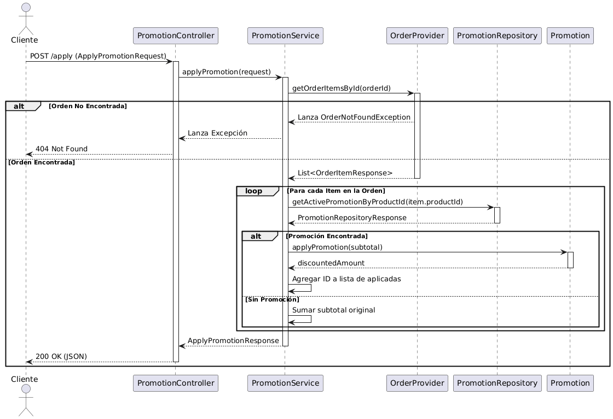


<details>
<summary><strong>🟢 Explicación del Flujo</strong></summary>

Esta funcionalidad es el núcleo del negocio. El cliente (o el microservicio de Pagos) solicita calcular el total a pagar para una orden específica. El `PromotionService` primero se comunica con el microservicio externo de Orders mediante el `OrderProvider` para obtener los ítems del pedido. Si la orden existe, el servicio itera sobre cada producto y consulta al repositorio si hay una promoción activa asociada. Si encuentra una, delega a la entidad `Promotion` el cálculo matemático del descuento sobre el subtotal del ítem; si no, suma el precio pleno. Al finalizar el ciclo, consolida el monto total final y genera una lista con los IDs de las promociones que fueron efectivas, retornando esta información en un DTO de respuesta.

</details>

---

### 📊 Tipos de errores manejados

<div align="center">

| 🔢 **Código HTTP** | ⚠️ **Escenario** | 💬 **Mensaje de Error** |
|:------------------:|:----------------|:------------------------|
|  | JSON malformado | `"Solicitud JSON Inválida..."` |
|  | Orden no existe | `"Order not found with id: {orderId}"` |
|  | Fallo en servicio de órdenes | `"Failed to get order items for order: {orderId}"` |
|  | Error inesperado | `"Unexpected error"` |

</div>

---

### 3️⃣ Obtener Todas las Promociones


**Endpoint principal:**  
`GET /api/v1/promotions`

---

### 📦 Estructura de la Solicitud (Request)

No aplica (GET sin cuerpo).

---

### 📦 Estructura de la Respuesta (Response)

<div align="center">

| 🏷️ Campo | 🗃️ Tipo | 📝 Descripción |
|:---:|:---:|:---|
| promotionId | String | Identificador único de la promoción. |
| productId | String | Producto asociado. |
| isActive | Boolean | Estado actual. |
| promotionMultiplier | Double | Porcentaje de descuento. |

</div>

---

### ✅ Happy Path (Ejemplo de Uso Exitoso)

1. El cliente solicita el listado de todas las promociones.
2. El sistema recupera todos los documentos de la colección.
3. Se transforman los datos a DTOs de respuesta.
4. Se retorna la lista de promociones.


**Request (Solicitud):**
```json
GET /api/v1/promotions
```

**Response (Respuesta):**
```json
[
  {
    "promotionId": "PROMO-001",
    "productId": "PROD-001",
    "isActive": true,
    "promotionMultiplier": 0.15
  },
  {
    "promotionId": "PROMO-002",
    "productId": "PROD-050",
    "isActive": false,
    "promotionMultiplier": 0.10
  }
]
```

---

### 🖼️ Diagrama de Secuencia

  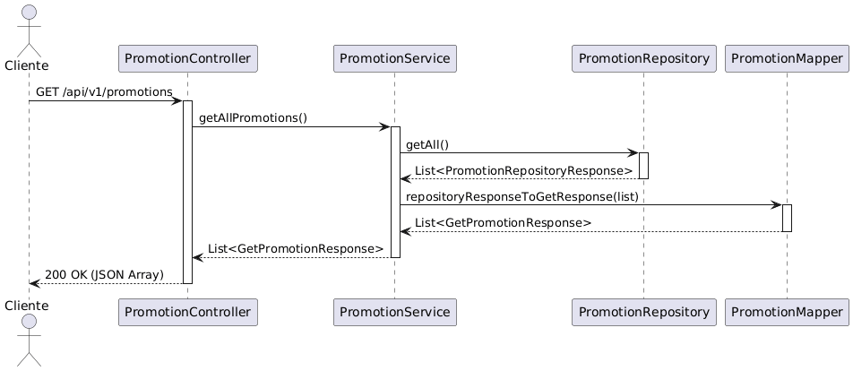


<details>
<summary><strong>🟢 Explicación del Flujo</strong></summary>

El flujo para consultar el inventario de promociones es directo. El `PromotionController` recibe la petición GET y llama al método `getAllPromotions` del servicio. Este invoca al repositorio para recuperar todos los documentos de la colección Promotions en MongoDB. Los datos crudos recuperados son transformados por el `PromotionMapper` en una lista de DTOs `GetPromotionResponse`, ocultando detalles de infraestructura y exponiendo solo la información relevante al cliente (IDs, fechas, estado y producto asociado).

</details>

---

### 📊 Tipos de errores manejados

<div align="center">

| 🔢 **Código HTTP** | ⚠️ **Escenario** | 💬 **Mensaje de Error** |
|:------------------:|:----------------|:------------------------|
|  | Error de conexión a BD | `"Unexpected error"` |

</div>

---

### 4️⃣ Actualizar Promoción


**Endpoint principal:**  
`PUT /api/v1/promotions/{promotionId}`

---

### 📦 Estructura de la Solicitud (Request)

<div align="center">

| 🏷️ Campo | 🗃️ Tipo | ⚠️ Restricciones | 📝 Descripción |
|---|---|:---:|---|
| promotionId | String | Obligatorio (Path) | Debe coincidir con el ID de la URL. |
| startDate | Date | Opcional | Nueva fecha de inicio. |
| endDate | Date | Opcional | Nueva fecha de fin. |
| promotionMultiplier | Double | Opcional, > 0 | Nuevo valor del descuento. |

</div>

---

### 📦 Estructura de la Respuesta (Response)

<div align="center">

| 🔢 Código HTTP | 📝 Descripción |
|:---:|---|
|  | **Actualización exitosa.** Retorna el objeto actualizado. |

</div>

---

### ✅ Happy Path (Ejemplo de Uso Exitoso)

1. El cliente envía el ID en la URL y los nuevos datos en el cuerpo.
2. El sistema verifica la existencia de la promoción.
3. Se aplican las reglas de negocio sobre los nuevos valores.
4. Se actualiza el registro en la base de datos.
5. Se retorna la promoción actualizada.


**Request (Solicitud):**
```json
PUT /api/v1/promotions/PROMO-001
{
  "promotionMultiplier": 0.20
}
```

**Response (Respuesta):**
```json
{
  "promotionId": "PROMO-001",
  "productId": "PROD-001",
  "isActive": true,
  "startDate": "2023-11-01T00:00:00Z",
  "endDate": "2023-11-30T23:59:59Z",
  "promotionMultiplier": 0.20
}
```


---

### 🖼️ Diagrama de Secuencia

  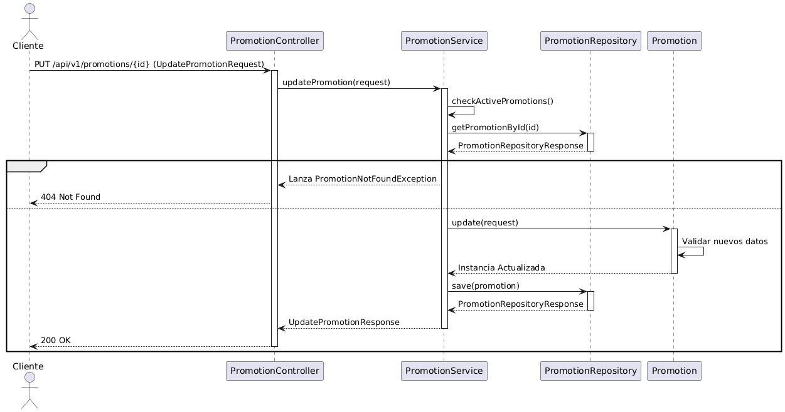


<details>
<summary><strong>🟢 Explicación del Flujo</strong></summary>

Para modificar una promoción, el cliente envía el ID en la URL y los nuevos datos en el cuerpo. El `PromotionService` primero verifica la existencia de la promoción en la base de datos. Si no existe, lanza una excepción `PromotionNotFoundException`. Si existe, reconstruye el objeto de dominio `Promotion` y ejecuta el método `update`, el cual aplica las reglas de negocio sobre los nuevos valores (por ejemplo, asegurar que las nuevas fechas sean coherentes). Una vez actualizado el objeto en memoria, se persiste nuevamente en MongoDB y se retorna la confirmación con los datos actualizados.

</details>

---

### 📊 Tipos de errores manejados

<div align="center">

| 🔢 **Código HTTP** | ⚠️ **Escenario** | 💬 **Mensaje de Error** |
|:------------------:|:----------------|:------------------------|
|  | Datos inválidos | `"Promotion start date must be before end date"` |
|  | ID no existe | `"Promotion not found: {promotionId}"` |
|  | Error inesperado | `"Unexpected error"` |

</div>

---

### 5️⃣ Eliminar Promoción


**Endpoint principal:**  
`DELETE /api/v1/promotions/{promotionId}`

---

### 📦 Estructura de la Solicitud (Request)

<div align="center">

| 🏷️ Campo | 🗃️ Tipo | ⚠️ Restricciones | 📝 Descripción |
|---|---|:---:|---|
| promotionId | String | Obligatorio (Path) | Identificador de la promoción a eliminar. |

</div>

---

### 📦 Estructura de la Respuesta (Response)

<div align="center">

| 🔢 Código HTTP | 📝 Descripción |
|:---:|---|
|  | **Eliminación exitosa.** No retorna cuerpo. |

</div>

---

### ✅ Happy Path (Ejemplo de Uso Exitoso)

1. El cliente envía el ID de la promoción a eliminar.
2. El sistema verifica que la promoción exista.
3. Se elimina el documento de la base de datos.
4. Se retorna `204 NO CONTENT`.


**Request (Solicitud):**
```json
DELETE /api/v1/promotions/PROMO-001
```

**Response (Respuesta):**
```json
204 NO CONTENT
```


---

### 🖼️ Diagrama de Secuencia

  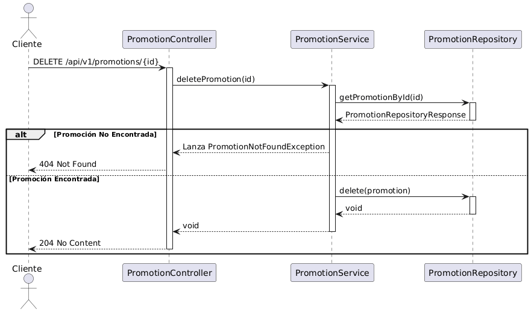


<details>
<summary><strong>🟢 Explicación del Flujo</strong></summary>

El proceso de eliminación comienza validando la existencia del recurso. El `PromotionService` busca la promoción por su ID; si no la encuentra, interrumpe el flujo con un error 404. Si la promoción existe, ordena al repositorio eliminar el documento correspondiente de la colección. Al finalizar exitosamente, el controlador responde con un código HTTP 204, indicando que la operación se realizó correctamente y no hay contenido que mostrar.

</details>

---


### 📊 Tipos de errores manejados

<div align="center">

| 🔢 **Código HTTP** | ⚠️ **Escenario** | 💬 **Mensaje de Error** |
|:------------------:|:----------------|:------------------------|
|  | ID no existe | `"Promotion not found: {promotionId}"` |
|  | Error inesperado | `"Unexpected error"` |

</div>

---


## 7. 📊 Diagramas

Esta sección muestra los diagramas clave del microservicio de promociones, ilustrando su arquitectura, componentes principales y despliegue.

---

### 🏗️ Diagrama de Componentes — Vista General
<div align="center">

</div>


---

### 🔍 Diagrama de Componentes — Vista Específica

<div align="center">
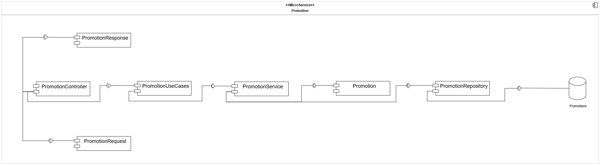
</div>

**Arquitectura Hexagonal:**  
El microservicio de Promotion separa controladores, casos de uso, lógica de negocio y adaptadores externos para mantener modularidad y escalabilidad.

**Flujo principal:**

- **PromotionController**
  - Recibe solicitudes HTTP (`PromotionRequest`, etc.).
  - Delega la ejecución al puerto `PromotionUseCases`, implementado por `PromotionService`.

**Lógica de Negocio (Dominio):**

- **PromotionService**
  - Orquesta la lógica de aplicación.
  - Se comunica con la entidad de dominio `Promotion`.
  - Utiliza `PromotionMapper` para convertir entidades en DTOs de salida.

- **Promotion (Entidad)**
  - Encapsula las reglas de negocio:
    - Validación de rangos de fechas (fecha de inicio vs. fecha fin).
    - Cálculo del valor del descuento.
    - Verificación del estado activo de la promoción.

**Integración y Adaptadores:**

- **Persistencia:**
  - `PromotionService` invoca el puerto `PromotionRepository`.
  - `PromotionRepositoryAdapter` traduce entre el modelo de dominio y la persistencia (`PromotionDocument`).
  - `PromotionRepository` (Spring Data Mongo) persiste en MongoDB.

- **Manejo de Errores:**
  - `Promotion` lanza excepciones de dominio.
  - `PromotionController` maneja excepciones específicas.
  - `GlobalExceptionHandler` estandariza respuestas HTTP.

> El microservicio Promotion gestiona el ciclo de vida, validación y aplicación de descuentos y campañas promocionales dentro del ecosistema de pagos.

### 🔌 Servicios Externos Integrados

El microservicio se integra con otros sistemas mediante REST/HTTP a través del API Gateway.

<div align="center">

| 🌍 **Microservicio** | ⚙️ **Operación** | 📋 **Propósito** |
|:---------------|:----------------|:-----------------------|
| **Payment** | Validar/Aplicar Promoción | Consultar si un código es válido y obtener el monto a descontar antes de procesar el pago |

</div>

**Dominio y Mapeo:**

- La entidad `Promotion` encapsula la lógica central.
- `PromotionMapper` transforma los datos entre capas, asegurando respuestas completas y correctas.

> El diagrama ilustra cómo el dominio de promociones se mantiene aislado de la infraestructura, permitiendo cambiar la base de datos o los adaptadores externos sin afectar las reglas de negocio.

---
### 📊 Diagrama de base de datos

<div align="center">
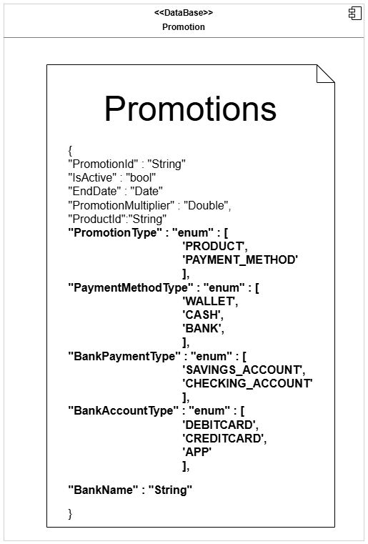
</div>

El microservicio Promotion utiliza **MongoDB** como motor de base de datos NoSQL, seleccionado por su eficiencia en la gestión de documentos JSON y flexibilidad de esquema. La base de datos, configurada como `Promotions`, aloja la colección del mismo nombre, la cual es responsable de persistir las reglas de negocio, vigencias y porcentajes de descuento aplicables a los productos.

#### 📋 Colección: `Promotions`

La colección `Promotions` almacena documentos con la siguiente estructura:

<div align="center">

| 🏷️ Campo | 🗃️ Tipo | 📝 Descripción | ⚠️ Restricciones |
|:---|:---|:---|:---|
| **_id** | `ObjectId` | Identificador único generado automáticamente por MongoDB | Primary Key |
| **promotionId** | `String` | Identificador de negocio de la promoción (ej: promo-1) | Único, Obligatorio |
| **productId** | `String` | Referencia al producto sobre el cual aplica el descuento | Obligatorio, Indexado |
| **isActive** | `Boolean` | Bandera lógica que indica si la promoción está habilitada | Obligatorio |
| **promotionMultiplier** | `Double` | Factor decimal del descuento (ej: 0.10 para 10%) | Obligatorio, > 0 |
| **startDate** | `String` | Fecha de inicio de vigencia (Formato ISO) | Obligatorio |
| **endDate** | `String` | Fecha de finalización de vigencia (Formato ISO) | Obligatorio |

</div>

**Características de diseño:**

- **Persistencia:** Se gestiona a través de la clase `PromotionDocument`, mapeada directamente a la colección mediante Spring Data MongoDB.
- **Optimización:** El repositorio `MongoPromotionRepository` implementa métodos de consulta personalizados (`@Query`) como `findByProductIdAndIsActive` y `getActivePromotions` para filtrar eficientemente las promociones vigentes.
- **Adaptador:** La arquitectura implementa el patrón Adaptador mediante `PromotionRepositoryAdapter`, que utiliza `PromotionRepositoryMapper` para transformar los documentos de la base de datos en entidades de dominio `Promotion`.
- **Fechas:** El manejo de fechas se estandariza como cadenas de texto ISO mediante el componente utilitario `DateUtils`.

---

### 📦 Diagrama de Clases del Dominio

<div align="center">
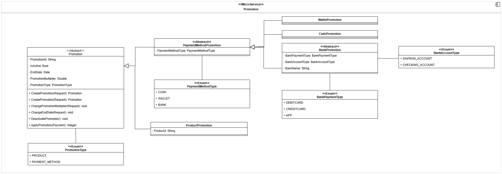
</div>

**Resumen del diseño de dominio:**

La arquitectura de dominio se centra en la clase abstracta **Promotion**, que define el contrato base y el estado compartido por todas las estrategias de descuento.

- **Entidad de Dominio (DDD):** `Promotion` encapsula identificadores (`promotionId`), estado de vigencia (`isActive`), rango de fechas (`startDate`, `endDate`) y el factor de descuento (`promotionMultiplier`).
- **Factory Method:** `CreatePromotion` centraliza las reglas de validación invariantes (como asegurar que la fecha de inicio sea anterior a la de fin y que el multiplicador sea positivo).
- **Polimorfismo:**
  - `ProductPromotion`: Vincula el descuento a un `productId` específico.
  - `PaymentMethodPromotion`: Clase abstracta que especializa el descuento según el medio de pago.
    - `WalletPromotion` y `CashPromotion`: Estrategias simplificadas.
    - `BankPromotion`: Especialización con atributos como `BankName` y tipos de cuenta.
- **Enumeraciones:** `PromotionType` y `PaymentMethodType` actúan como discriminadores para la persistencia y lógica de negocio.

> Este diseño permite que el método `ApplyPromotion` ejecute la lógica de cálculo de precios de manera transparente, independientemente de la implementación concreta.

---

### 📦 DTOs Principales

<div align="center">
<div style="background:#111; color:#fff; border-radius:12px; padding:24px 12px; box-shadow:0 2px 12px #0002;">

<table style="border:2px solid #4A90E2; border-radius:8px;">
  <caption style="font-size:1.15em; font-weight:bold; color:#4A90E2; padding:8px;">📨 <u>Request DTOs</u></caption>
  <thead style="background:#222; color:#fff;">
    <tr>
      <th style="padding:8px;">DTO</th>
      <th style="padding:8px;">Atributos Principales</th>
      <th style="padding:8px;">Descripción</th>
    </tr>
  </thead>
  <tbody>
    <tr>
      <td><b>CreatePromotionRequest</b></td>
      <td>productId, isActive, startDate, endDate, promotionMultiplier</td>
      <td>Solicitud para registrar una nueva regla de descuento.</td>
    </tr>
    <tr>
      <td><b>UpdatePromotionRequest</b></td>
      <td>promotionId, startDate, endDate, promotionMultiplier</td>
      <td>Petición para modificar las condiciones de una promoción existente.</td>
    </tr>
    <tr>
      <td><b>ApplyPromotionRequest</b></td>
      <td>orderId</td>
      <td>Solicitud para calcular el precio final aplicando descuentos vigentes.</td>
    </tr>
  </tbody>
</table>

<br>

<table style="border:2px solid #43A047; border-radius:8px;">
  <caption style="font-size:1.15em; font-weight:bold; color:#43A047; padding:8px;">📤 <u>Response DTOs</u></caption>
  <thead style="background:#222; color:#fff;">
    <tr>
      <th style="padding:8px;">DTO</th>
      <th style="padding:8px;">Atributos Principales</th>
      <th style="padding:8px;">Descripción</th>
    </tr>
  </thead>
  <tbody>
    <tr>
      <td><b>GetPromotionResponse</b></td>
      <td>promotionId, productId, isActive, startDate, endDate, promotionMultiplier</td>
      <td>Representación pública completa de una promoción.</td>
    </tr>
    <tr>
      <td><b>UpdatePromotionResponse</b></td>
      <td>promotionId, startDate, endDate, promotionMultiplier</td>
      <td>Confirmación de la actualización realizada.</td>
    </tr>
    <tr>
      <td><b>ApplyPromotionResponse</b></td>
      <td>finalAmount, appliedPromotions</td>
      <td>Resultado del cálculo de precios con descuentos aplicados.</td>
    </tr>
    <tr>
      <td><b>ApiError</b></td>
      <td>code, message, timestamp, path</td>
      <td>Estructura estandarizada para el retorno de excepciones.</td>
    </tr>
  </tbody>
</table>

<br>

<table style="border:2px solid #F0AD4E; border-radius:8px;">
  <caption style="font-size:1.15em; font-weight:bold; color:#F0AD4E; padding:8px;">⚙️ <u>DTOs Internos & Enums</u></caption>
  <thead style="background:#222; color:#fff;">
    <tr>
      <th style="padding:8px;">Objeto</th>
      <th style="padding:8px;">Detalle</th>
      <th style="padding:8px;">Descripción</th>
    </tr>
  </thead>
  <tbody>
    <tr>
      <td><b>PromotionDocument</b></td>
      <td>promotionId, productId, isActive, startDate, endDate, promotionMultiplier</td>
      <td>Entidad de persistencia mapeada a la colección de MongoDB.</td>
    </tr>
    <tr>
      <td><b>PromotionRepositoryResponse</b></td>
      <td>promotionDocument</td>
      <td>Wrapper utilizado por el adaptador de persistencia.</td>
    </tr>
    <tr>
      <td><b>OrderItemResponse</b></td>
      <td>id, orderId, productId, subtotal, productType</td>
      <td>DTO externo para mapear la respuesta del microservicio de Orders.</td>
    </tr>
    <tr>
      <td><b>OrderType</b></td>
      <td>CAFETERIA, PAPELERIA</td>
      <td>Clasificación del tipo de producto.</td>
    </tr>
  </tbody>
</table>

</div>
</div>

---

### 🗄️ Diagrama de Despliegue

<div align="center">

</div>

---

#### 🚀 Despliegue e Infraestructura

El microservicio de **Promotion** se ejecuta como un contenedor Docker en **Azure App Service**, respaldado por una arquitectura robusta de CI/CD y servicios en la nube.

- **Ejecución:** Contenedor Docker en Azure App Service (Imagen desde ACR).
- **Frontend:** React + TypeScript consume la API vía **API Gateway** (Enrutamiento, CORS, Auth).
- **Persistencia:** **MongoDB Atlas** (Colección `Promotions`) con alta disponibilidad y backups.
- **CI/CD (GitHub Actions):**
  - `ci.yml`: Pruebas (JUnit 5), Cobertura (JaCoCo), Calidad (SonarQube).
  - `cd_dev.yml`: Despliegue automático a Desarrollo (Rama `develop`).
  - `cd_prod.yml`: Despliegue automático a Producción (Rama `main`).
- **Construcción:** Dockerfile Multi-stage (Maven Build -> JRE Alpine Runtime).
- **Configuración:** Variables de entorno en Azure (`SPRING_PROFILES_ACTIVE`, `MONGODB_URI`).

<div align="center">

| 🌐 **Componente**         | 📝 **Descripción**                                 |
|--------------------------|---------------------------------------------------|
| Azure App Service        | Hosting del contenedor Docker del microservicio   |
| Azure Container Registry | Almacenamiento y versionado de imágenes Docker    |
| GitHub Actions           | Automatización de CI/CD y calidad de código       |
| API Gateway              | Punto de entrada único para el frontend           |
| MongoDB Atlas            | Base de datos NoSQL, alta disponibilidad y backups|

</div>

---

## 8. ⚠️ Manejo de Errores

El backend de **ECIExpress** implementa un **mecanismo centralizado de manejo de errores** que garantiza uniformidad, claridad y seguridad en todas las respuestas enviadas al cliente cuando ocurre un fallo.

Este sistema permite mantener una comunicación clara entre el backend y el frontend, asegurando que los mensajes de error sean legibles, útiles y coherentes, sin exponer información sensible del servidor.

---

### 🧠 Estrategia general de manejo de errores

El sistema utiliza una **clase global** que intercepta todas las excepciones lanzadas desde los controladores REST.  
A través de la anotación `@ControllerAdvice`, se centraliza el manejo de errores, evitando el uso repetitivo de bloques `try-catch` en cada endpoint.

Cada error se transforma en una respuesta **JSON estandarizada**, que mantiene un formato uniforme para todos los tipos de fallos.


---

### ⚙️ Global Exception Handler

El **Global Exception Handler** es una clase con la anotación `@ControllerAdvice` que captura y maneja todas las excepciones del sistema.  
Utiliza métodos con `@ExceptionHandler` para procesar errores específicos y devolver una respuesta personalizada acorde al tipo de excepción.

**✨ Características principales:**

- ✅ **Centraliza** la captura de excepciones desde todos los controladores
- ✅ **Retorna mensajes JSON consistentes** con el mismo formato estructurado
- ✅ **Asigna códigos HTTP** según la naturaleza del error (400, 404, 409, 500, etc.)
- ✅ **Define mensajes descriptivos** que ayudan tanto al desarrollador como al usuario
- ✅ **Mantiene la aplicación limpia**, eliminando bloques try-catch redundantes
- ✅ **Mejora la trazabilidad** y facilita la depuración en los entornos de prueba y producción


---

### 🧩 Validaciones en DTOs

Además del manejo global de errores, el sistema utiliza **validaciones automáticas** sobre los DTOs (Data Transfer Objects) para garantizar que los datos que llegan al servidor cumplan con las reglas de negocio antes de ejecutar cualquier lógica.

Estas validaciones se implementan mediante las anotaciones de **Javax Validation** y **Hibernate Validator**, como `@NotBlank`, `@NotNull`, `@Email`, `@Min`, `@Max`, entre otras.


Si alguno de los campos no cumple las validaciones, se lanza automáticamente una excepción del tipo `MethodArgumentNotValidException`.  
Esta es capturada por el **Global Exception Handler**, que devuelve una respuesta JSON estandarizada con el detalle del campo inválido.


> 💡 Gracias a este mecanismo, se asegura que las peticiones erróneas sean detectadas desde el inicio, reduciendo fallos en capas más profundas como servicios o repositorios.

---

### ✅ Beneficios del manejo centralizado

<div align="center">

| 🎯 **Beneficio** | 📋 **Descripción** |
|:-----------------|:-------------------|
| **🎯 Uniformidad** | Todas las respuestas de error tienen el mismo formato JSON estandarizado |
| **🔧 Mantenibilidad** | Agregar nuevas excepciones no requiere modificar cada controlador |
| **🔒 Seguridad** | Oculta los detalles internos del servidor y evita exponer trazas sensibles |
| **📍 Trazabilidad** | Cada error incluye información contextual (ruta, timestamp y descripción) |
| **🤝 Integración fluida** | Facilita la comunicación con frontend y herramientas como Postman/Swagger |

</div>

---

> Gracias a este enfoque, el backend de ECIExpress logra un manejo de errores **robusto**, **escalable** y **seguro**, garantizando una experiencia de usuario más confiable y profesional.

---


---

## 9. 🧪 Evidencia de las pruebas y cómo ejecutarlas

El backend de **ECIExpress** implementa una **estrategia integral de pruebas** que garantiza la calidad, funcionalidad y confiabilidad del código mediante pruebas unitarias y de integración.

---

### 🎯 Tipos de pruebas implementadas

<div align="center">

| 🧪 **Tipo de Prueba** | 📋 **Descripción** | 🛠️ **Herramientas** |
|:---------------------|:-------------------|:--------------------|
| **Pruebas Unitarias** | Validan el funcionamiento aislado de componentes (servicios, estrategias, validadores) |   |
| **Cobertura de Código** | Mide el porcentaje de código cubierto por las pruebas |  |
| **Pruebas de Integración** | Verifican la interacción entre capas y servicios externos |  |

</div>

---

### 🚀 Cómo ejecutar las pruebas

#### **1️⃣ Ejecutar todas las pruebas**

Desde la raíz del proyecto, ejecuta:

```bash
mvn clean test
```

Este comando:
- Limpia compilaciones anteriores (`clean`)
- Ejecuta todas las pruebas unitarias y de integración (`test`)
- Muestra el resultado en la consola

#### **2️⃣ Generar reporte de cobertura con JaCoCo**

```bash
mvn clean test jacoco:report
```

El reporte HTML se generará en:
```
target/site/jacoco/index.html
```

Abre este archivo en tu navegador para ver:
- Cobertura por paquete
- Cobertura por clase
- Líneas cubiertas vs. no cubiertas

#### **3️⃣ Ejecutar pruebas desde IntelliJ IDEA**

1. Click derecho sobre la carpeta `src/test/java`
2. Selecciona **"Run 'Tests in...'**
3. Ver resultados en el panel inferior

#### **4️⃣ Ejecutar una prueba específica**

```bash
mvn test -Dtest=PromotionControllerTest
```

---

### 🧪 Ejemplo de prueba de integración

A continuación se muestra un ejemplo real de una prueba de integración para el controlador de promociones (`PromotionController`), donde se valida la creación exitosa de una promoción simulando una petición HTTP.

```java
    @Test
    @DisplayName("Should create promotion and return 201")
    void createPromotion_returns201() throws Exception {
        long now = System.currentTimeMillis();
        String body = """
                {
                  "productId": "prod-1",
                  "isActive": true,
                  "endDate": %d,
                  "startDate": %d,
                  "promotionMultiplier": 0.10
                }
                """.formatted(now + 86_400_000, now - 86_400_000);

        mockMvc.perform(post("/api/v1/promotions")
                        .contentType(MediaType.APPLICATION_JSON)
                        .content(body))
                .andExpect(status().isCreated());

        verify(promotionUseCases).createPromotion(any());
    }
```


---

### 🖼️ Evidencias de ejecución

1. **Consola mostrando pruebas ejecutándose exitosamente**

    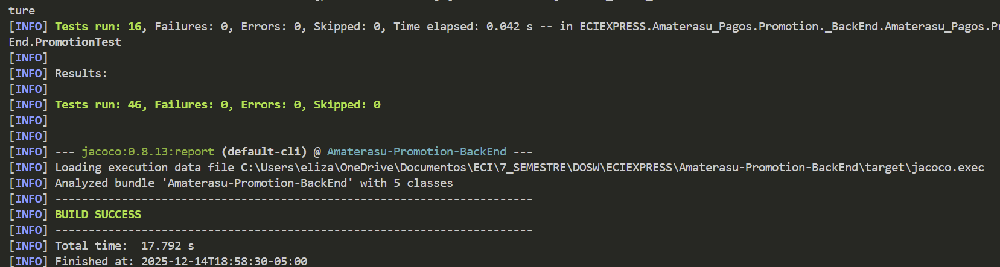

2. **Reporte JaCoCo con cobertura de código**

    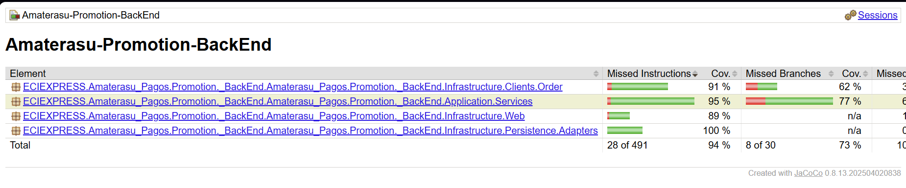

---

### ✅ Criterios de aceptación de pruebas

Para considerar el sistema correctamente probado, se debe cumplir:

- ✅ **Cobertura mínima del 80%** en servicios y lógica de negocio
- ✅ **Todas las pruebas en estado PASSED** (sin fallos)
- ✅ **Cero errores de compilación** en el código de pruebas
- ✅ **Pruebas de casos felices y casos de error** implementadas

---

### 🔄 Integración con CI/CD

Las pruebas se ejecutan automáticamente en cada **push** o **pull request** mediante GitHub Actions:

```yaml
  - name: Build + Test + Coverage
    run: mvn -B clean verify
```

Esto garantiza que ningún cambio roto llegue a producción.

---

## 10. 🗂️ Código de la implementación organizado en las respectivas carpetas

El microservicio de **Promociones de Amaterasu** sigue una **arquitectura hexagonal (puertos y adaptadores)** que separa las responsabilidades en capas bien definidas, promoviendo la escalabilidad, testabilidad y mantenibilidad del código.

---

### 📂 Estructura general del proyecto (Scaffolding)

```
Amaterasu-Promotion-BackEnd/
│
├── 📁 src/
│   ├── 📁 main/
│   │   ├── 📁 java/ECIEXPRESS/Amaterasu_Pagos/Promotion/_BackEnd/
│   │   │   ├── 📁 Application/                               # 🔵 CAPA DE APLICACIÓN
│   │   │   │   ├── 📁 Mappers/
│   │   │   │   ├── 📁 Ports/
│   │   │   │   └── 📁 Services/
│   │   │   │
│   │   │   ├── 📁 Config/                                    # ⚙️ Configuraciones
│   │   │   │
│   │   │   ├── 📁 Domain/                                    # 🟢 CAPA DE DOMINIO
│   │   │   │   ├── 📁 Model/
│   │   │   │   └── 📁 Port/
│   │   │   │
│   │   │   ├── 📁 Exception/                                 # ⚠️ Manejo de errores
│   │   │   │
│   │   │   ├── 📁 Infrastructure/                            # 🟠 CAPA DE INFRAESTRUCTURA
│   │   │   │   ├── 📁 Clients/
│   │   │   │   ├── 📁 Persistence/
│   │   │   │   └── 📁 Web/
│   │   │   │
│   │   │   └── 📁 Utils/                                     # 🛠️ Utilidades
│   │   │
│   │   └── 📁 resources/                                     # 📄 Archivos de configuración
│   │
│   └── 📁 test/                                              # 🧪 PRUEBAS
│
├── 📁 docs/                                                  # 📚 Documentación
│
├── 📄 Dockerfile
├── 📄 docker-compose.yml
├── 📄 pom.xml
└── 📄 README.md
```

---

> ℹ️ Todo el código fuente está documentado y comentado para facilitar su comprensión, mantenimiento y extensión por parte de cualquier desarrollador.

### 🏛️ Arquitectura Hexagonal Implementada

<div align="center">

| 🎨 **Capa** | 📋 **Responsabilidad** | 🔗 **Dependencias** |
|:-----------|:----------------------|:-------------------|
| **🟢 Domain** | Lógica de negocio pura, entidades (`Promotion`, `ProductPromotion`) y puertos (interfaces) | ❌ Ninguna (independiente) |
| **🔵 Application** | Casos de uso, servicios (`PromotionService`) y validaciones | ✅ Solo `Domain` |
| **🟠 Infrastructure** | Controladores REST, adaptadores de persistencia (`MongoPromotionRepository`) y clientes externos | ✅ `Domain` + `Application` |

</div>

**Flujo de dependencias:** `Infrastructure → Application → Domain`

---

### 🎯 Principios de diseño aplicados

<div align="center">

| ✅ **Principio** | 📋 **Implementación** |
|:----------------|:---------------------|
| **Separación de responsabilidades** | Cada capa tiene un propósito único y bien definido |
| **Inversión de dependencias** | Las capas externas dependen de interfaces definidas en el dominio |
| **Independencia del framework** | La lógica de negocio no depende de Spring o MongoDB |
| **Patrón Factory** | Creación centralizada de objetos de dominio válidos |
| **Testabilidad** | Fácil crear pruebas unitarias mockeando puertos y adaptadores |
| **Mantenibilidad** | Cambios en una capa no afectan a las demás |

</div>  

---

## 11. 🚀 Ejecución del Proyecto

### 📋 Prerrequisitos
- **Java 17**
- **Maven 3.8+**
- **Docker** (Opcional)

### 🛠️ Opción 1: Ejecución Local (Maven)

```bash
# 1. Clonar repositorio
git clone https://github.com/ECIXPRESS/Amaterasu-Promotion-BackEnd.git

# 2. Ejecutar aplicación
mvn spring-boot:run
```
📍 **URL Local:** `http://localhost:8084`  
📚 **Documentación API:** `http://localhost:8084/swagger-ui.html`

### 🐳 Opción 2: Ejecución con Docker

```bash
# Levantar el contenedor
docker-compose up --build -d
```

### ⚙️ Configuración
El servicio se conecta por defecto a los otros microservicios en `localhost`. Para cambiar esto, ajusta `application.yml` o usa variables de entorno.

## 12. ☁️ CI/CD y Despliegue en Azure

El proyecto implementa un **pipeline automatizado** con **GitHub Actions** para garantizar la calidad del código y el despliegue continuo en **Azure Cloud**.

---

### 🔗 Enlaces de Despliegue

<div align="center">

| 🌍 Ambiente | 🔗 URL | 📝 Estado |
|:-----------|:-------|:---------|
| **🟢 Producción** | [amaterasu-promotions-prod-eeezdjdeg5cvawgm.eastus2-01.azurewebsites.net/swagger-ui/index.html    ](amaterasu-promotions-prod-eeezdjdeg5cvawgm.eastus2-01.azurewebsites.net/swagger-ui/index.html  ) |  |
| **🟠 Desarrollo** | [amaterasu-promotions-dev-brfgdnfgghhhb2f0.eastus2-01.azurewebsites.net/swagger-ui/index.html   ](amaterasu-promotions-dev-brfgdnfgghhhb2f0.eastus2-01.azurewebsites.net/swagger-ui/index.html   ) |  |

</div>

---

### 🔄 Pipeline de Automatización

El flujo de trabajo se divide en dos etapas principales:

1. **Integración Continua (CI)**: Se ejecuta en cada *Pull Request*.
   - Compilación del proyecto con Maven.
   - Ejecución de pruebas unitarias y de integración.
   - Análisis de calidad de código con **SonarQube**.
   - Generación de reportes de cobertura con **JaCoCo**.

2. **Despliegue Continuo (CD)**: Se ejecuta al hacer merge a ramas principales.
   - Construcción de la imagen Docker.
   - Publicación de la imagen en **Azure Container Registry (ACR)**.
   - Despliegue automático en **Azure App Service**.
     - `develop` ➔ Ambiente de Desarrollo.
     - `main` ➔ Ambiente de Producción.

---

### ☁️ Infraestructura

<div align="center">

| Componente | Servicio Azure | Propósito |
|:-----------|:---------------|:----------|
| **Compute** |  | Ejecución del contenedor Docker del microservicio. |
| **Storage** |  | Almacenamiento privado de imágenes Docker. |
| **Database** |  | Persistencia de datos transaccionales. |
| **Monitoring** |  | Logs, métricas y trazabilidad en tiempo real. |

</div>

---

### 📊 Evidencias de Despliegue

**Azure Web App - Aplicación en ejecución**

<div align="center">
  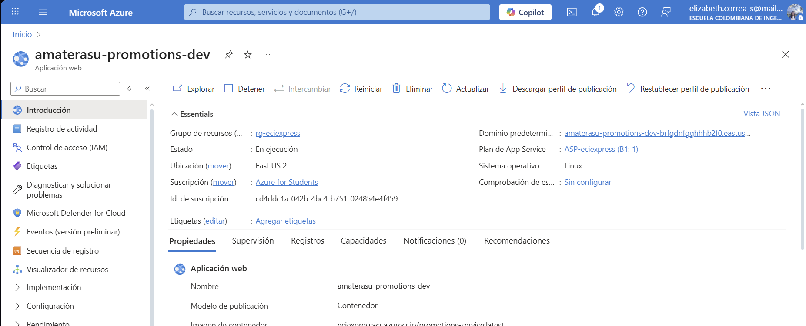
  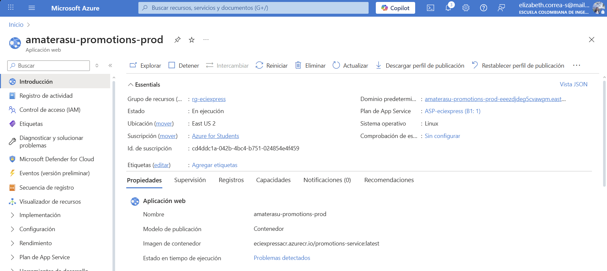
</div>

---

## 13. 🤝 Contribuciones y Metodología

El equipo **Amaterasu** aplicó la metodología **Scrum** con sprints semanales para garantizar una entrega incremental de valor y mejora continua.

### 👥 Equipo Scrum

| Rol | Responsabilidad |
|:---|:---|
| **Product Owner** | Priorización del Backlog y maximización de valor. |
| **Scrum Master** | Facilitador del proceso y eliminación de impedimentos. |
| **Developers** | Diseño, implementación y pruebas de funcionalidades. |

### 🔄 Eventos y Artefactos

- **Sprints Semanales**: Ciclos cortos de desarrollo.
- **Daily Scrum**: Sincronización diaria (15 min).
- **Sprint Review & Retrospective**: Demostración de incrementos y mejora de procesos.
- **Backlogs**: Gestión de tareas en Jira/GitHub Projects.

### 🎯 Valores del Equipo
Compromiso, Coraje, Enfoque, Apertura y Respeto fueron los pilares para afrontar desafíos técnicos como la integración con pasarelas de pago.

---

<div align="center">

### 🏆 Equipo **Amaterasu**


> 💡 **ECIEXPRESS** es un proyecto académico, pero su arquitectura y calidad están pensadas para ser escalables y adaptables a escenarios reales en instituciones educativas.

**🎓 Escuela Colombiana de Ingeniería Julio Garavito**

</div>

---


